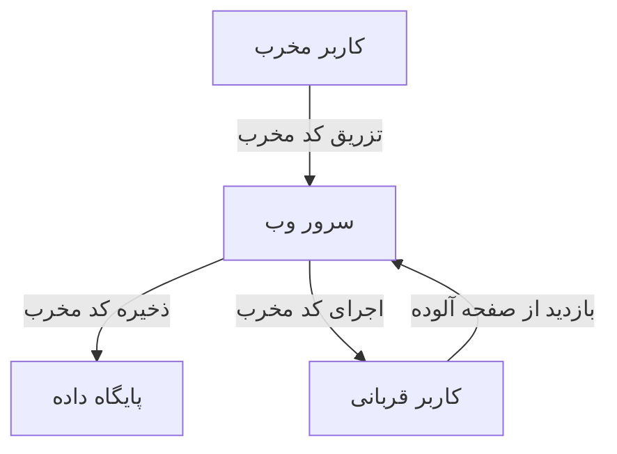
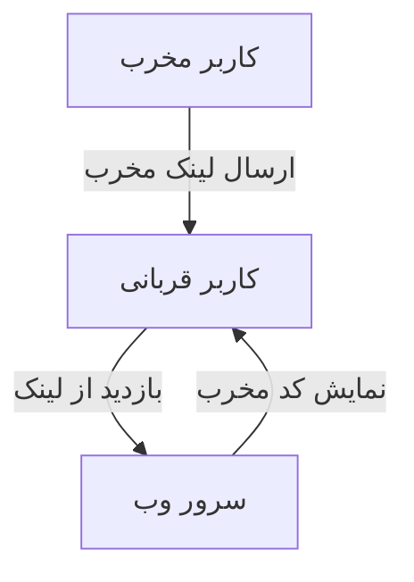
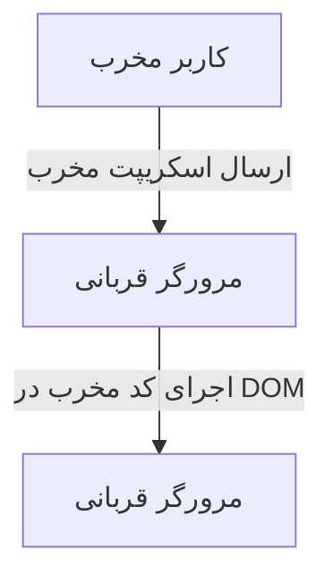

# تحقیق جامع درباره حملات XSS (Cross-Site Scripting)

## مقدمه

حملات XSS (Cross-Site Scripting) یکی از رایج‌ترین و خطرناک‌ترین نوع حملات وب است که به مهاجمان اجازه می‌دهد تا کدهای مخرب را در وب‌سایت‌های معتبر تزریق کنند. این حملات می‌توانند منجر به سرقت کوکی‌ها، اطلاعات حساس کاربر، تغییر محتوای وب‌سایت‌ها و اجرای عملیات مخرب دیگر شوند.

## انواع حملات XSS

حملات XSS به سه دسته اصلی تقسیم می‌شوند:

### 1. XSS ذخیره‌شده (Stored XSS)

در این نوع از حملات، کد مخرب در سرور ذخیره می‌شود و هر بار که یک کاربر صفحه را مشاهده می‌کند، کد اجرا می‌شود. این نوع حمله معمولاً در بخش‌هایی از وب‌سایت مانند تالارهای گفتگو، نظرات کاربران و پروفایل‌ها رخ می‌دهد.



### 2. XSS بازتابی (Reflected XSS)

این حملات زمانی رخ می‌دهند که ورودی کاربر به صورت مستقیم در پاسخ HTTP برگشتی به کاربر نمایش داده شود، بدون اینکه ابتدا توسط سرور اعتبارسنجی یا فیلتر شود.



### 3. XSS مبتنی بر DOM

این نوع حمله زمانی رخ می‌دهد که کد مخرب به صورت مستقیم در DOM مرورگر تزریق شود، بدون اینکه توسط سرور پردازش شود. این حمله از طریق تغییر یا دستکاری ساختار DOM رخ می‌دهد.



## راه‌های مقابله با حملات XSS

برای مقابله با حملات XSS، باید از چندین روش امنیتی استفاده کرد:

### 1. اعتبارسنجی و فیلتر ورودی‌ها

تمام ورودی‌های کاربر باید اعتبارسنجی و فیلتر شوند. از کتابخانه‌های امنیتی برای پاک‌سازی و حذف کدهای مخرب از ورودی‌های کاربر استفاده کنید.

### 2. استفاده از هدرهای امنیتی

استفاده از هدرهای امنیتی مانند Content Security Policy (CSP) به مرورگرها کمک می‌کند تا منابعی که باید اجرا شوند را محدود کنند.

```plaintext
Content-Security-Policy: default-src 'self'; script-src 'self' https://trusted.cdn.com
```

### 3. رمزگذاری خروجی‌ها

اطمینان حاصل کنید که تمام داده‌های خروجی به صورت مناسب رمزگذاری شده‌اند تا مانع از اجرای کدهای مخرب شوند.

### 4. اجتناب از نمایش ورودی کاربر

هر زمان که ممکن است، از نمایش مستقیم ورودی‌های کاربر در صفحات وب اجتناب کنید.

## مثال‌هایی از بزرگترین حملات XSS

### 1. حمله MySpace Samy (2005)

یکی از مشهورترین حملات XSS در سال 2005 رخ داد که طی آن یک کرم رایانه‌ای به نام Samy توانست در پروفایل کاربران MySpace نفوذ کند و به سرعت گسترش یابد. این حمله باعث شد تا پروفایل‌ها به طور خودکار به یکدیگر اضافه شوند و پیام "but most of all, Samy is my hero" نمایش داده شود. Samy Kamkar، سازنده این کرم، توانست بیش از یک میلیون پروفایل را در کمتر از 24 ساعت تحت تاثیر قرار دهد.

### 2. حمله Twitter Mikeyy (2009)

در سال 2009، چندین حمله XSS توسط یک کرم به نام Mikeyy به شبکه اجتماعی توییتر وارد شد. این حمله باعث شد تا کاربران توییتر پیام‌هایی را به صورت خودکار منتشر کنند که حاوی کدهای مخرب بود و دیگر کاربران را به کلیک بر روی لینک‌های مخرب تشویق می‌کرد.

### 3. حمله PayPal (2019)

در سال 2019، یک محقق امنیتی به نام Vakhtang Toradze یک آسیب‌پذیری XSS را در PayPal کشف کرد که به او اجازه داد کدهای مخرب را در بخش پیام‌های کاربری این وب‌سایت تزریق کند. این حمله می‌توانست به سرقت اطلاعات کاربری و ایجاد صفحات تقلبی منجر شود.

## نتیجه‌گیری

حملات XSS یکی از تهدیدات جدی در امنیت وب هستند که می‌توانند به سرعت گسترش یابند و خسارات زیادی به بار آورند. با استفاده از روش‌های پیشگیری مناسب و ابزارهای امنیتی، می‌توان از وقوع این حملات جلوگیری کرد. آگاهی کاربران و توسعه‌دهندگان وب از خطرات XSS و روش‌های مقابله با آن‌ها، نقش مهمی در حفظ امنیت سایبری دارد.
