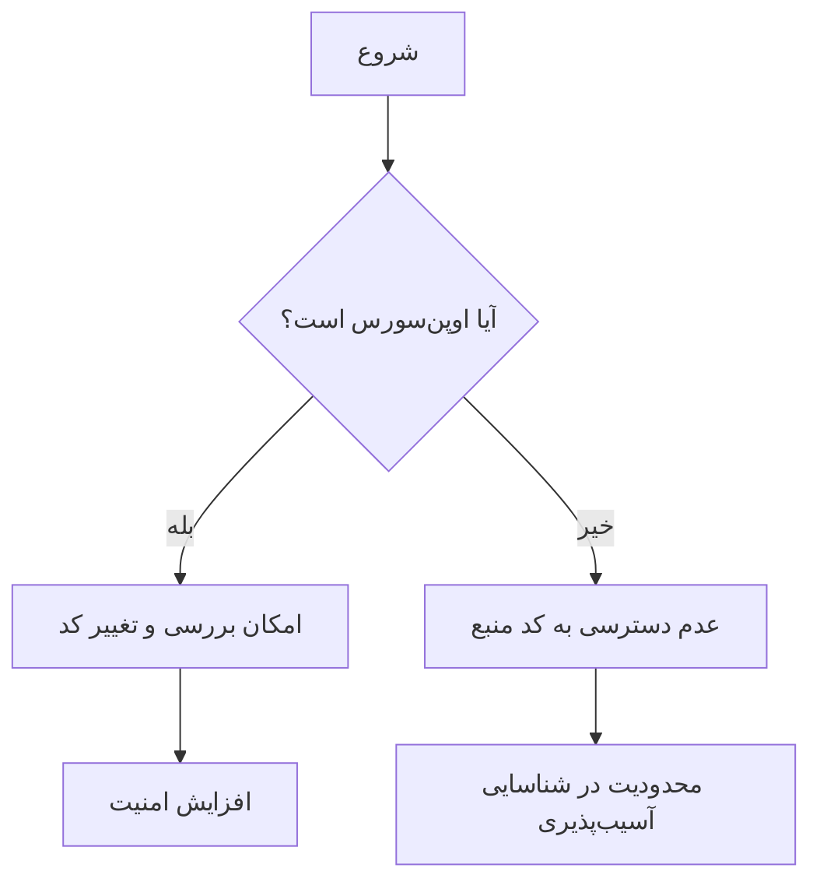

# کاربرد لینوکس در امنیت سایبری و مراکز عملیات امنیتی (SOC)

## مقدمه

امنیت سایبری به معنای حفاظت از سیستم‌ها، شبکه‌ها و داده‌ها در برابر حملات سایبری و دسترسی غیرمجاز است. با توجه به افزایش روزافزون حملات سایبری، اهمیت امنیت سایبری به‌طور فزاینده‌ای رو به رشد است. یکی از ابزارهای کلیدی در این حوزه، سیستم‌عامل لینوکس است. لینوکس به دلیل ویژگی‌های منحصربه‌فرد خود از جمله اوپن‌سورس بودن، انعطاف‌پذیری، و امنیت بالا، نقش مهمی در امنیت سایبری و SOCها ایفا می‌کند. در این تحقیق، به بررسی مزایا، کاربردها و چالش‌های استفاده از لینوکس در این زمینه می‌پردازیم.

## ویژگی‌های برجسته لینوکس در امنیت سایبری

### 1. اوپن‌سورس بودن

لینوکس به عنوان یک سیستم‌عامل اوپن‌سورس، به کاربران و توسعه‌دهندگان این امکان را می‌دهد که کد منبع آن را بررسی و تغییر دهند. این ویژگی به متخصصان امنیتی اجازه می‌دهد تا آسیب‌پذیری‌های احتمالی را شناسایی کرده و به سرعت آن‌ها را برطرف کنند.



### 2. پایداری و عملکرد بالا

لینوکس به دلیل طراحی کارآمد و بهره‌گیری از منابع سخت‌افزاری، از پایداری و عملکرد بالایی برخوردار است.

### 3. امنیت ذاتی

لینوکس به دلیل کنترل دقیق دسترسی کاربران و فرآیندها، به عنوان یکی از امن‌ترین سیستم‌عامل‌ها شناخته می‌شود.

## ابزارهای امنیتی لینوکس

لینوکس میزبان بسیاری از ابزارهای امنیتی و تست نفوذ است که برای شناسایی و جلوگیری از تهدیدات سایبری به کار می‌روند.

### 1. Wireshark

```bash
# برای شروع به تحلیل بسته‌های شبکه با Wireshark:
sudo wireshark
```

### 2. Metasploit

```bash
# برای شروع Metasploit Framework:
msfconsole
```

### 3. Nmap

```bash
# برای اسکن شبکه با Nmap:
nmap -sP 192.168.1.0/24
```

### 4. Snort

```bash
# برای راه‌اندازی Snort به عنوان یک IDS:
snort -c /etc/snort/snort.conf -i eth0
```

## کاربرد لینوکس در مراکز عملیات امنیتی (SOC)

### 1. مدیریت اطلاعات و رویدادهای امنیتی (SIEM)

نرم‌افزارهای SIEM برای جمع‌آوری، تحلیل و مدیریت داده‌های امنیتی استفاده می‌شوند.

### 2. تست نفوذ و ارزیابی امنیتی

لینوکس به دلیل داشتن توزیع‌های تخصصی مانند Kali Linux و Parrot Security OS، به عنوان ابزار اصلی برای اجرای تست‌های نفوذ و ارزیابی امنیتی استفاده می‌شود.

### 3. خودکارسازی و اسکریپت‌نویسی

```bash
# مثال از یک اسکریپت Bash برای خودکارسازی وظایف:
for i in {1..10}; do
   echo "Hello, $i"
done
```

## مزایای استفاده از لینوکس در امنیت سایبری

### 1. انعطاف‌پذیری

لینوکس به کاربران اجازه می‌دهد تا سیستم‌عامل را بر اساس نیازهای خاص خود پیکربندی کنند.

### 2. هزینه کمتر

بسیاری از توزیع‌ها و ابزارهای امنیتی لینوکس رایگان هستند.

### 3. پشتیبانی جامعه

لینوکس دارای جامعه بزرگی از توسعه‌دهندگان و متخصصان است.

## چالش‌های استفاده از لینوکس در امنیت سایبری

### 1. نیاز به تخصص فنی

مدیریت و پیکربندی لینوکس نیاز به دانش فنی و تجربه دارد.

### 2. سازگاری نرم‌افزارها

برخی نرم‌افزارهای تجاری ممکن است با لینوکس سازگار نباشند.

## نتیجه‌گیری

لینوکس به عنوان یک سیستم‌عامل قدرتمند و انعطاف‌پذیر، نقش حیاتی در امنیت سایبری و عملیات‌های SOC ایفا می‌کند.
