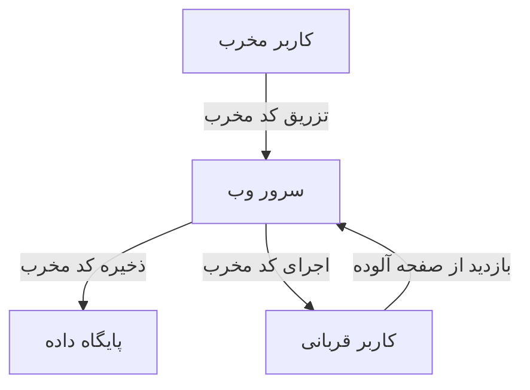
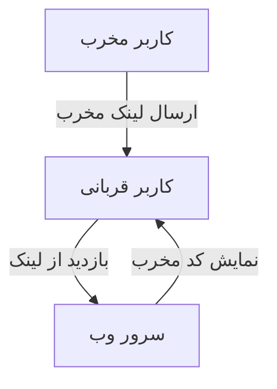
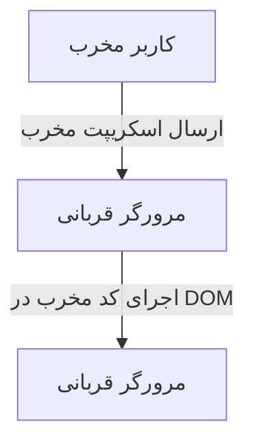

# تحقیق جامع درباره حملات XSS (Cross-Site Scripting)

## مقدمه

حملات XSS (Cross-Site Scripting) یکی از رایج‌ترین و خطرناک‌ترین نوع حملات وب است که به مهاجمان اجازه می‌دهد تا کدهای مخرب را در وب‌سایت‌های معتبر تزریق کنند. این حملات می‌توانند منجر به سرقت کوکی‌ها، اطلاعات حساس کاربر، تغییر محتوای وب‌سایت‌ها و اجرای عملیات مخرب دیگر شوند.

## انواع حملات XSS

حملات XSS به سه دسته اصلی تقسیم می‌شوند:

### 1. XSS ذخیره‌شده (Stored XSS)

#### توضیحات:
در حملات XSS ذخیره‌شده، کد مخرب به طور دائم در سرور وب ذخیره می‌شود. این نوع حمله معمولاً در بخش‌هایی از وب‌سایت رخ می‌دهد که کاربران می‌توانند داده‌هایی مانند پیام‌ها، نظرات یا پروفایل‌های کاربری را ذخیره کنند. هنگامی که یک کاربر قربانی به صفحه آلوده دسترسی پیدا می‌کند، اسکریپت مخرب از سرور بارگذاری و اجرا می‌شود.

#### نحوه عملکرد:
- مهاجم کد جاوااسکریپت مخربی را در یک فرم ورودی کاربر، مانند نظرات، قرار می‌دهد.
- این کد به پایگاه داده سرور ارسال و ذخیره می‌شود.
- هر بار که یک کاربر صفحه آلوده را مشاهده می‌کند، کد مخرب از سرور بارگذاری و در مرورگر کاربر اجرا می‌شود.
- این کد می‌تواند اطلاعات حساس کاربر را سرقت کند، کوکی‌ها را ربوده یا دیگر عملیات‌های مخرب را انجام دهد.



#### مثال واقعی:
در سال 2005، کرم MySpace Samy از یک حمله XSS ذخیره‌شده استفاده کرد تا به سرعت در میان پروفایل‌های کاربران MySpace گسترش یابد.

### 2. XSS بازتابی (Reflected XSS)

#### توضیحات:
حملات XSS بازتابی زمانی رخ می‌دهند که ورودی کاربر به صورت مستقیم در پاسخ HTTP برگشتی به کاربر نمایش داده شود، بدون اینکه توسط سرور اعتبارسنجی یا فیلتر شود. این نوع حمله معمولاً با فریب کاربر به کلیک بر روی یک لینک مخرب که شامل کد مخرب است، انجام می‌شود.

#### نحوه عملکرد:
- مهاجم یک لینک مخرب ایجاد می‌کند که شامل کد جاوااسکریپت است.
- لینک به قربانی ارسال می‌شود (از طریق ایمیل، پیام فوری، یا شبکه‌های اجتماعی).
- قربانی روی لینک کلیک می‌کند و درخواست به سرور ارسال می‌شود.
- سرور بدون فیلتر کردن ورودی، کد مخرب را در پاسخ خود بازتاب می‌دهد.
- کد مخرب در مرورگر قربانی اجرا می‌شود و می‌تواند داده‌ها را سرقت کند یا فعالیت‌های مخرب دیگر انجام دهد.



#### مثال واقعی:
در حملات XSS بازتابی، هدف اصلی معمولاً کاربران عادی هستند که به صورت تصادفی به لینک‌های مخرب هدایت می‌شوند، مانند حمله XSS در توییتر در سال 2009.

### 3. XSS مبتنی بر DOM

#### توضیحات:
حملات XSS مبتنی بر DOM زمانی رخ می‌دهند که کد جاوااسکریپت به صورت مستقیم در DOM مرورگر تزریق شود و اجرا شود، بدون اینکه نیاز به ارتباط با سرور باشد. این نوع حمله بر اساس تغییر یا دستکاری ساختار DOM مرورگر قربانی انجام می‌شود.

#### نحوه عملکرد:
- مهاجم یک کد جاوااسکریپت مخرب ایجاد می‌کند که مستقیماً بر روی DOM مرورگر تأثیر می‌گذارد.
- قربانی به صفحه وب آلوده دسترسی پیدا می‌کند.
- کد مخرب در مرورگر قربانی اجرا می‌شود و مستقیماً بر DOM تأثیر می‌گذارد، بدون نیاز به تعامل با سرور.
- کد می‌تواند اطلاعات حساس را بخواند یا به مرورگر دستور دهد که به سرور دیگری درخواست ارسال کند.



#### مثال واقعی:
حملات XSS مبتنی بر DOM معمولاً پیچیده‌تر هستند و به دلیل اینکه به سرور وابسته نیستند، شناسایی و رفع آن‌ها دشوارتر است.

## راه‌های مقابله با حملات XSS

### 1. اعتبارسنجی و فیلتر ورودی‌ها
تمام ورودی‌های کاربر باید اعتبارسنجی و فیلتر شوند. از کتابخانه‌های امنیتی برای پاک‌سازی و حذف کدهای مخرب از ورودی‌های کاربر استفاده کنید.

### 2. استفاده از هدرهای امنیتی
استفاده از هدرهای امنیتی مانند Content Security Policy (CSP) به مرورگرها کمک می‌کند تا منابعی که باید اجرا شوند را محدود کنند.

```plaintext
Content-Security-Policy: default-src 'self'; script-src 'self' https://trusted.cdn.com
```

### 3. رمزگذاری خروجی‌ها
اطمینان حاصل کنید که تمام داده‌های خروجی به صورت مناسب رمزگذاری شده‌اند تا مانع از اجرای کدهای مخرب شوند.

### 4. اجتناب از نمایش ورودی کاربر
هر زمان که ممکن است، از نمایش مستقیم ورودی‌های کاربر در صفحات وب اجتناب کنید.

## مثال‌هایی از بزرگترین حملات XSS

### 1. حمله MySpace Samy (2005)
کرم MySpace Samy توانست در کمتر از 24 ساعت بیش از یک میلیون پروفایل را تحت تأثیر قرار دهد و پیام‌های خودکار را به حساب کاربران اضافه کند.

### 2. حمله Twitter Mikeyy (2009)
چندین حمله XSS توسط یک کرم به نام Mikeyy به شبکه اجتماعی توییتر وارد شد و پیام‌های خودکاری را منتشر کرد که حاوی کدهای مخرب بود.

### 3. حمله PayPal (2019)
یک محقق امنیتی به نام Vakhtang Toradze یک آسیب‌پذیری XSS را در PayPal کشف کرد که می‌توانست به سرقت اطلاعات کاربری منجر شود.

## نتیجه‌گیری

حملات XSS یکی از تهدیدات جدی در امنیت وب هستند که می‌توانند به سرعت گسترش یابند و خسارات زیادی به بار آورند. با استفاده از روش‌های پیشگیری مناسب و ابزارهای امنیتی، می‌توان از وقوع این حملات جلوگیری کرد. آگاهی کاربران و توسعه‌دهندگان وب از خطرات XSS و روش‌های مقابله با آن‌ها، نقش مهمی در حفظ امنیت سایبری دارد.
